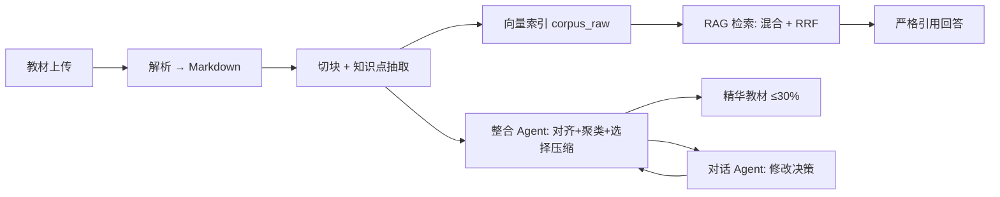

# 学科知识整合智能体（Knowledge Integration Agent）

> 第一届 AI 全栈极速黑客松参赛作品 · 浙江大学未来学习中心 · 2026.5
>
> 用 AI 帮教师把 **7 本教材**整合成 **≤30%** 的精华版本，构建可视化知识图谱，并提供**带原文引用**的 RAG 精准问答。

## 核心能力

| 能力 | 说明 |
|------|------|
| 📥 多格式解析 | PDF / Markdown / TXT / DOCX → 统一 Markdown 中间格式 |
| 🧠 知识点抽取 | LLM few-shot 抽取原子概念 + 关系（prerequisite/parallel/contains/applies_to） |
| 🌐 知识图谱可视化 | ECharts 力导向图 · 频次映射 · 教材色彩区分 · 点击查详情 |
| 🔗 跨教材整合 | 双重对齐（embedding 召回 + LLM 精判）+ Union-Find 聚类 + 选择式压缩 |
| 🔍 RAG 精准问答 | 混合检索（向量 + BM25 + RRF）· 严格引用原文 · 拒答机制 |
| 💬 对话 Agent | function calling · 教师可用自然语言修改整合决策 |

## 架构设计：Hybrid Function-Agent

不为「拆 Agent」而拆。在确定性环节使用纯函数（解析、嵌入、检索），在需要自主决策与多工具协调的环节使用 Agent（**整合 Agent** + **对话 Agent**）。详见 [docs/Agent架构说明.md](docs/Agent架构说明.md)。



## 快速开始

### 环境要求

- Python ≥ 3.10
- Node.js ≥ 18
- 4GB+ 可用内存（嵌入模型加载约 200MB）

### 本地开发

```bash
# 1. 克隆仓库
git clone https://github.com/<your-username>/ai-hackathon-knowledge-agent.git
cd ai-hackathon-knowledge-agent

# 2. 配置环境变量
cp .env.example .env
# 编辑 .env，填入 DEEPSEEK_API_KEY

# 3. 后端
python3 -m venv .venv
source .venv/bin/activate
pip install -r requirements.txt
uvicorn src.backend.main:app --reload --port 8000

# 4. 前端（另开一个终端）
cd src/frontend
npm install
npm run dev
# 访问 http://localhost:5173
```

### Docker 一键运行（生产/部署）

```bash
docker build -t knowledge-agent .
docker run -p 7860:7860 -e DEEPSEEK_API_KEY=sk-xxx knowledge-agent
# 访问 http://localhost:7860
```

## 部署到魔搭创空间（ModelScope Studio）

本仓库已包含魔搭识别所需的 YAML metadata（README 头部）和 Dockerfile。

1. 在 [https://modelscope.cn/studios](https://modelscope.cn/studios) 创建 Studio
2. SDK 选择 **Docker**，关联本 GitHub 仓库
3. 在 Settings → Secrets 中添加：
   - `DEEPSEEK_API_KEY`：你的 DeepSeek API key
4. 构建完成后，Studio URL 即为公网部署链接

## 项目结构

```
.
├── README.md
├── PLAN-v2.md                 # 4h 作战手册（开发参考）
├── Dockerfile                 # 多阶段构建
├── requirements.txt
├── .env.example
├── src/
│   ├── backend/               # FastAPI
│   │   ├── main.py
│   │   ├── routers/           # parse / graph / integrate / rag / chat
│   │   ├── services/          # parser / llm / embedder / aligner / ...
│   │   ├── benchmark/         # 自建 RAG 评测集
│   │   └── static/            # 前端构建产物
│   └── frontend/              # React + Vite + TS
├── docs/
│   ├── 需求分析.md
│   ├── 系统设计.md
│   ├── Agent架构说明.md       # 评分核心文档
│   └── P2-技术报告.md         # 选交
├── report/
│   ├── 整合报告.md            # 7 本教材实测结果
│   └── 精华教材.md            # 30% 压缩产物
└── data/                      # gitignore: 教材 / 数据库 / 索引 / 模型缓存
```

## 关键技术决策

| 决策 | 选择 | 理由 |
|------|------|------|
| LLM | DeepSeek-V4（OpenAI 兼容） | 中文性价比最佳，JSON mode 稳定 |
| 嵌入 | BGE-small-zh-v1.5 本地推理 | 100MB，免 API 延迟与计费 |
| 向量库 | ChromaDB | 内嵌 Python，零部署 |
| 检索 | 向量 + BM25 → RRF 融合 → top-5 | 论文级 baseline，免参数调优 |
| PDF 解析 | PyMuPDF4LLM | 直出 Markdown，保留章节层级 |
| 30% 压缩 | **原文精选** + 元数据导览（不重写） | 保证引用 100% 真实可点击 |
| Agent 框架 | **不引入**，OpenAI SDK function calling 手动编排 | 5h 调试 callback 不划算 |

详细论证见 [docs/Agent架构说明.md](docs/Agent架构说明.md)。

## 评分维度对照

| 维度 | 满分 | 关键交付 |
|------|------|---------|
| A 文档 | 15 | README + 需求分析 + 系统设计 + Agent 架构说明 + 整合报告 |
| B 功能 | 25 | 10 项 P0 全实现 + 双重对齐 + 混合检索 |
| C 可视化 | 13 | ECharts 力导向 + 频次映射 + 搜索 + 多视图 |
| D Agent 架构 | 20 | Hybrid Function-Agent 论证 + 实验数据 |
| E 代码质量 | 17 | 模块化 + 类型注解 + Docker 一键部署 |
| F 创新 | 10 | 自建 benchmark + 选择式压缩 + 引用真实可点击 |

## License

MIT
