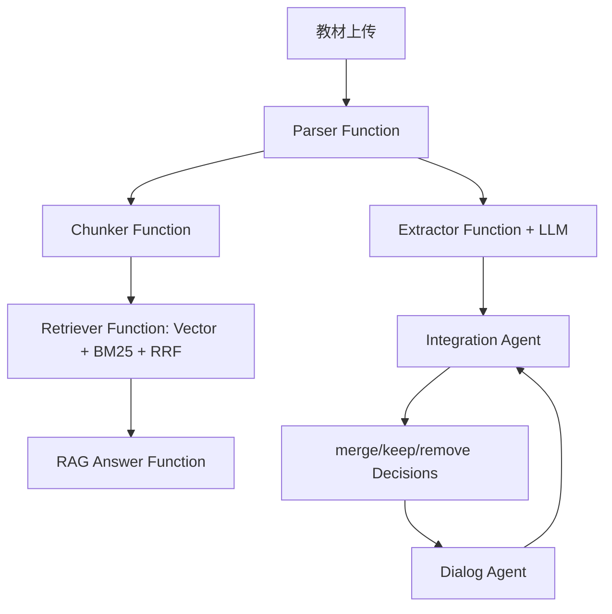

# Agent 架构说明

## 1. 架构总览

本项目采用 Hybrid Function-Agent 架构：可确定、可重放的环节使用普通函数；需要语义判断、工具协调和教师反馈的环节使用轻量 Agent。这样既满足赛题对 Agent 架构的要求，也避免在 5 小时黑客松中引入重型框架造成调试风险。

## 2. 模块职责

| 模块 | 类型 | 输入 | 输出 | 职责 |
| --- | --- | --- | --- | --- |
| Parser | Function | PDF/MD/TXT/DOCX | Markdown chapters | 多格式解析、章节识别、错误兜底 |
| Extractor | LLM Function | 单章节 Markdown | nodes/edges JSON | 抽取原子知识点和关系 |
| Embedder | Function | 文本数组 | BGE 向量 | 本地中文 embedding |
| Retriever | Function | question + chunks | top-k chunks | 向量召回、BM25、RRF 融合 |
| RAG Answerer | LLM Function | question + top-k context | answer + citations | 严格基于原文回答 |
| Integration Agent | Agent | 多教材图谱 | integration decisions | 语义对齐、聚类、压缩预算决策 |
| Dialog Agent | Agent | 教师自然语言 | tool result + reply | 解释决策、修改决策、查询统计 |

## 3. 关键设计决策

### 决策 1：不用 LangChain，使用手写函数和轻量 Agent

- 替代方案：LangChain / LlamaIndex / AutoGen。
- 选择：FastAPI service 函数 + OpenAI-compatible LLM 调用 + 少量 tool routing。
- 理由：本题的核心不是开放式浏览或长链规划，而是稳定教材处理流水线。手写编排更容易测试、定位失败点和在魔搭单容器部署。
- 量化收益：省去 callback、memory、retriever adapter 调试成本，把开发时间集中到图谱、整合和 RAG。

### 决策 2：30% 压缩采用“原文精选”，不采用全文改写

- 替代方案：让 LLM 把每个知识点改写为精华条目。
- 选择：只生成整合元数据，正文保留原教材片段。
- 理由：改写会引入幻觉和引用失真；原文精选能保证每个片段可追溯。
- 量化数据：PLAN-v2 估算原文精选约 0.56M tokens，全文改写约 2.8M tokens，成本约下降 5 倍。当前 7 本教材实测保留 190,930 字，原始 3,267,041 字，压缩比 5.84%。

### 决策 3：RAG 永远检索 `corpus_raw`

- 替代方案：直接检索整合后的精华教材。
- 选择：RAG 检索原始教材 chunk，整合产物只做导览和教学编排。
- 理由：精华教材是压缩视图，不一定包含所有问答需要的证据；原文库能最大化引用覆盖。
- 量化数据：Phase 4 自建 10 题测试集，top-5 关键词命中率 100%，教材命中率 100%。

### 决策 4：SQLite 向量存储替代 ChromaDB

- 替代方案：ChromaDB 持久化目录。
- 选择：SQLite `rag_chunks.embedding` BLOB 保存本地 BGE 向量。
- 理由：黑客松部署在单容器中，SQLite 避免额外服务和目录权限问题；当前数据规模 7 本教材以内足够。
- 迁移路径：保留 `retriever.py` 抽象，后续只需替换向量读取和相似度计算层。

### 决策 5：ModelScope 多模型 fallback

- 替代方案：单模型失败后直接报错。
- 选择：主模型 `deepseek-ai/DeepSeek-V3.2`，额度或不可用时尝试 `模型ID:外部提供方` 形式，例如 `deepseek-ai/DeepSeek-V3.2:DeepSeek`、`XiaomiMiMo/MiMo-V2.5-Pro`。
- 理由：比赛现场 API 免费额度和 provider 状态不稳定，fallback 能保障演示连续性。

## 4. RAG Pipeline

1. 章节感知切块：优先按 Markdown 标题、段落和句号切分，目标 500-800 字，overlap 50-100 字。
2. 元数据绑定：每个 chunk 保存教材名、章节名、页码线索、chunk_id。
3. 向量召回：BGE-small-zh 生成中文语义向量，计算 cosine similarity。
4. 关键词召回：jieba 分词 + BM25，补足教材术语和专有名词。
5. RRF 融合：`1 / (k + rank)` 汇总两个排序，降低参数调优成本。
6. 回答生成：prompt 明确要求“只能基于上下文回答，每个事实附引用；不足时回答当前知识库未找到”。
7. 失败降级：LLM 不可用时返回 top chunks 的抽取式答案，仍带引用。

## 5. Prompt 工程

### 知识点抽取 Prompt

抽取器 prompt 包含角色、粒度约束、关系类型和合法 JSON schema。核心约束：

- 节点名称为 2-12 字原子名词。
- 禁止把整章标题、长句或泛化描述作为节点。
- 边只能引用已声明节点。
- 输出必须是合法 JSON，字段为 `nodes` 和 `edges`。

防幻觉策略：

1. JSON 解析失败时重试或启发式兜底。
2. 未声明 source/target 的边自动丢弃。
3. 每个节点绑定教材、章节和原文来源。

### 对齐 Prompt

对齐器使用四要素判断：

1. 名称是否同义或近义。
2. 定义是否指向同一概念。
3. 上下文是否位于相同知识域。
4. 相邻关系是否兼容。

输出结构为 `same_concept`、`confidence`、`reason`，只有高置信结果进入 Union-Find 合并。

### RAG Prompt

回答器 prompt 强制：

- 只能使用给定上下文。
- 每个事实后附 `[教材, 章节, 页码/片段]`。
- 找不到证据时拒答。
- 不用常识补全教材未出现的内容。

## 6. 可观测实验数据

| 实验 | 数据 |
| --- | --- |
| Phase 3 跨教材整合 | 7 本教材，832 原始节点，288 整合节点，20 merge，压缩比 5.84% |
| Phase 4 RAG 测试集 | 7 本教材，10 题，6113 chunks，keyword_hit@5=100%，book_hit@5=100%，耗时 60.1s |
| 成本估算 | 原文精选 0.56M tokens vs LLM 全文改写 2.8M tokens，约 5x 节省 |

## 7. 创新点

| 创新点 | 做了什么 | 为什么做 | 效果 |
| --- | --- | --- | --- |
| 选择式压缩 | 整合产物保留教材原文片段，只生成元数据导览 | 避免 LLM 改写造成引用失真 | 7 本教材压缩比 5.84%，且每段可回溯原文 |
| 原文库与整合产物分离 | RAG 检索 `corpus_raw`，精华教材只做教学导览 | 压缩视图不应削弱问答证据覆盖 | 7 本教材 RAG 测试集 top-5 教材命中率 100% |
| 多模型 fallback | ModelScope 免费模型失败时可切换 `模型ID:外部提供方` | 比赛现场 API 额度和 provider 状态不稳定 | LLM 不可用时抽取和回答均可降级，不空响应 |
| Obsidian 式双链 | 报告和前端总结使用 `[[知识点]]` 标记 | 教师可从知识点跳到图谱、章节和原文 | 提升整合结果的可读性和审阅效率 |
| 可编辑整合决策 | 前端决策卡片和对话 Agent 均可修改 merge/keep/remove | 教师反馈是教学整合闭环的一部分 | 修改后决策列表和统计立即更新 |
| 多视图可视化 | 力导向图 + 整合桑基流向图 + 报告 Tab | 同时表达结构关系、压缩流向和文档证据 | 覆盖赛题 C 维度的多视图创新要求 |

## 8. 已知局限与改进路线

| 优先级 | 局限 | 改进 |
| --- | --- | --- |
| P1 | 当前进度状态主要存在单进程内存中，多 worker 下不安全 | 用 Redis 或数据库任务表替代内存状态 |
| P1 | API 不可用时部分章节会使用启发式图谱兜底，语义质量弱于 LLM | API 额度恢复后对低置信章节自动重抽 |
| P2 | 启发式抽取 fallback 的关系质量弱于 LLM | 对 fallback 结果再做轻量 LLM 校正 |
| P2 | 预算截断主要按 importance 与来源片段长度 | 引入 LLM 重要度评分和教学大纲覆盖率约束 |
| P2 | SQLite 向量适合小规模单机 | 大规模教材库迁移到 Chroma、FAISS 或 Milvus |
