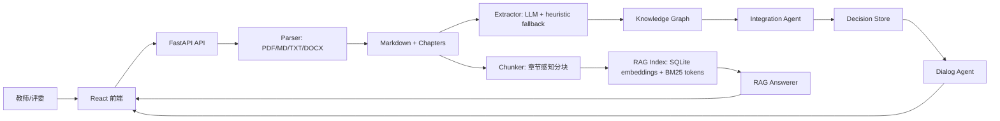

# 系统设计

## 总体架构

系统采用前后端分离与单容器部署。前端负责上传、图谱交互、整合审阅、RAG 问答和教师对话；后端负责解析、抽取、对齐、检索、回答生成和 SQLite 持久化。



## 技术选型

| 模块 | 技术 | 原因 |
| --- | --- | --- |
| 后端 | FastAPI | API 文档自动生成，异步任务接入简单 |
| 前端 | React + TypeScript + Vite | 开发速度快，适合复杂交互状态 |
| 图谱 | ECharts graph | 力导向、缩放、拖拽、点击、tooltip 成熟 |
| 存储 | SQLite | 单文件零配置，适合魔搭单容器部署 |
| LLM | ModelScope OpenAI-compatible API | 使用魔搭令牌，支持免费 API Inference 和外部 provider |
| Embedding | BGE-small-zh 本地推理 | 中文教材召回稳定，免 API 费用 |
| 检索 | 向量 + BM25 + RRF | 兼顾语义和教材术语精确匹配 |
| 部署 | Docker + docker-compose | 本地复现和魔搭部署一致 |

说明：PLAN-v2 原计划使用 ChromaDB；当前提交改为 SQLite `rag_chunks.embedding` BLOB 存储向量。该取舍减少运行时依赖与持久化目录风险，更适合黑客松单容器部署，后续可把 `retriever.py` 的向量读取替换为 Chroma。

## 数据流

1. 上传教材：`/api/upload` 保存文件并触发解析。
2. 章节解析：parser cascade 输出 Markdown、章节标题、正文、页码线索。
3. 图谱构建：`/api/graph/build/{textbook_id}` 调用 LLM 抽取节点和边，失败时启发式兜底。
4. RAG 建库：`/api/rag/index/sync` 对章节分块、生成 embedding、保存 chunk 元数据。
5. 跨教材整合：`/api/integrate/run` 汇总多本教材图谱，执行 embedding 召回、LLM 精判、Union-Find 聚类和预算控制。
6. 问答与迭代：`/api/rag/query` 返回带引用回答；`/api/chat` 解释或修改整合决策。

## 数据模型

| 表/对象 | 关键字段 |
| --- | --- |
| `textbooks` | `id`, `title`, `filename`, `status`, `created_at` |
| `chapters` | `id`, `textbook_id`, `title`, `level`, `content`, `page_start`, `page_end` |
| `knowledge_nodes` | `id`, `name`, `definition`, `category`, `importance`, `textbook_id`, `chapter_id` |
| `knowledge_edges` | `source`, `target`, `relation`, `weight`, `reason` |
| `rag_chunks` | `chunk_id`, `text`, `embedding`, `textbook_title`, `chapter_title`, `page` |
| `integration_runs` | `run_id`, `status`, `stats`, `summary_markdown` |
| `integration_decisions` | `decision_id`, `action`, `affected_nodes`, `reason`, `confidence`, `result_chunks` |
| `chat_messages` | `session_id`, `role`, `content`, `tool_name`, `created_at` |

## API 一览

| API | 方法 | 用途 | 请求示例 | 响应要点 |
| --- | --- | --- | --- | --- |
| `/api/health` | GET | 部署健康检查 | 无 | `ok`, `llm_key_configured`, `llm_model` |
| `/api/upload` | POST | 上传教材 | `multipart/form-data file=@book.pdf` | `textbook_id`, `status` |
| `/api/textbooks` | GET | 教材列表 | 无 | `items[]` |
| `/api/textbooks/{id}/chapters` | GET | 章节列表 | 无 | `chapters[]` |
| `/api/graph/build/{id}` | POST | 构建单本图谱 | 无 | `started`, `textbook_id` |
| `/api/graph/{id}` | GET | 获取单本图谱 | 无 | `nodes[]`, `edges[]` |
| `/api/graph` | GET | 获取全局图谱 | 无 | `nodes[]`, `edges[]` |
| `/api/integrate/run` | POST | 执行跨教材整合 | `{"textbook_ids":[]}` | `run_id`, `started` |
| `/api/integrate/status` | GET | 查看整合状态 | `?run_id=...` | `stats.compression_ratio` |
| `/api/integrate/decisions` | GET | 决策列表 | `?run_id=...` | `decisions[]` |
| `/api/integrate/summary` | GET | Markdown 摘要 | `?run_id=...` | `summary_markdown` |
| `/api/rag/index/sync` | POST | 同步建立 RAG 索引 | `{"textbook_ids":[]}` | `chunks`, `embedded` |
| `/api/rag/query` | POST | RAG 问答 | `{"question":"炎症的基本病理变化是什么？","top_k":5}` | `answer`, `citations`, `source_chunks` |
| `/api/chat` | POST | 教师对话 | `{"message":"保留炎症相关内容","session_id":"demo"}` | `reply`, `tool_name` |

## 前端界面

| 区域 | 组件 | 功能 |
| --- | --- | --- |
| 左侧 | `UploadPanel` | 拖拽上传、教材列表、章节列表 |
| 中间 | `GraphView` | 单本/全局图谱、节点点击、搜索、教材色彩、频次大小 |
| 右侧 | `IntegratePanel` | 整合状态、压缩比、决策列表、双链文本 |
| 右侧 | `RagPanel` | 建库、提问、答案与引用 |
| 右侧 | `ChatPanel` | 教师自然语言解释和修改决策 |

## 部署设计

本地复现：

```bash
cp .env.example .env
docker compose up -d --build
```

魔搭创空间：

1. README 头部声明 `sdk: docker` 与 `app_port: 7860`。
2. Dockerfile 多阶段构建前端与后端。
3. Secret 注入 `MODELSCOPE_ACCESS_TOKEN`、`LLM_MODEL`、`LLM_FALLBACK_MODELS`。
4. `/api/health` 用于部署验收。

